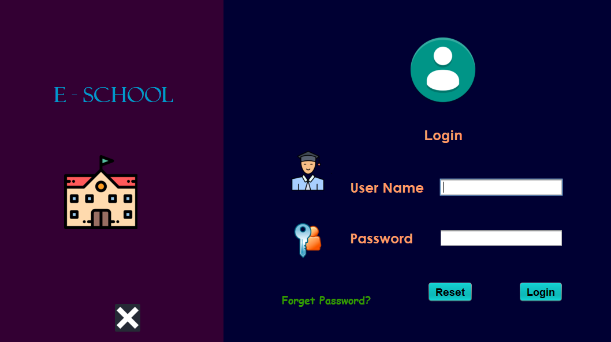
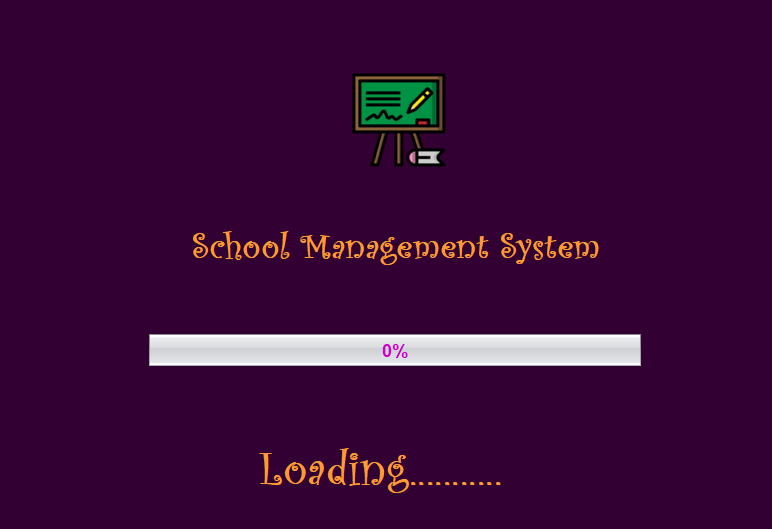
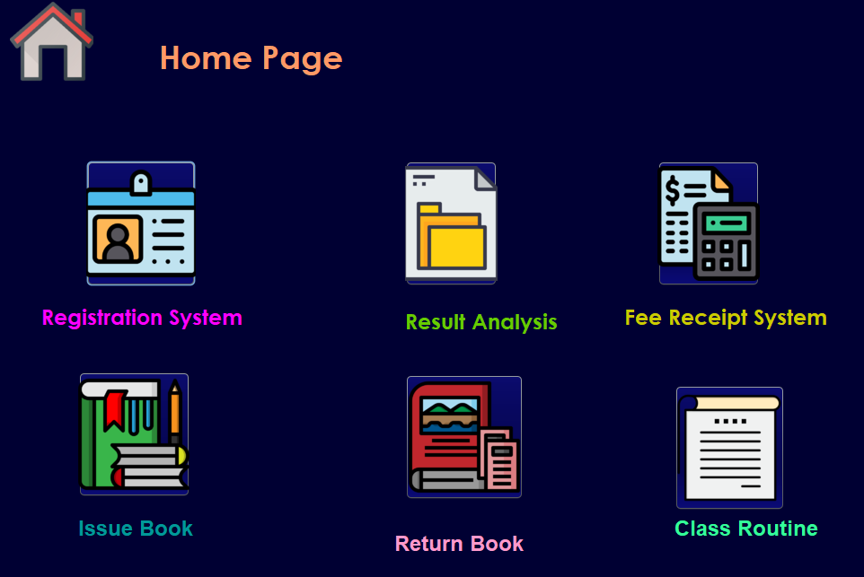
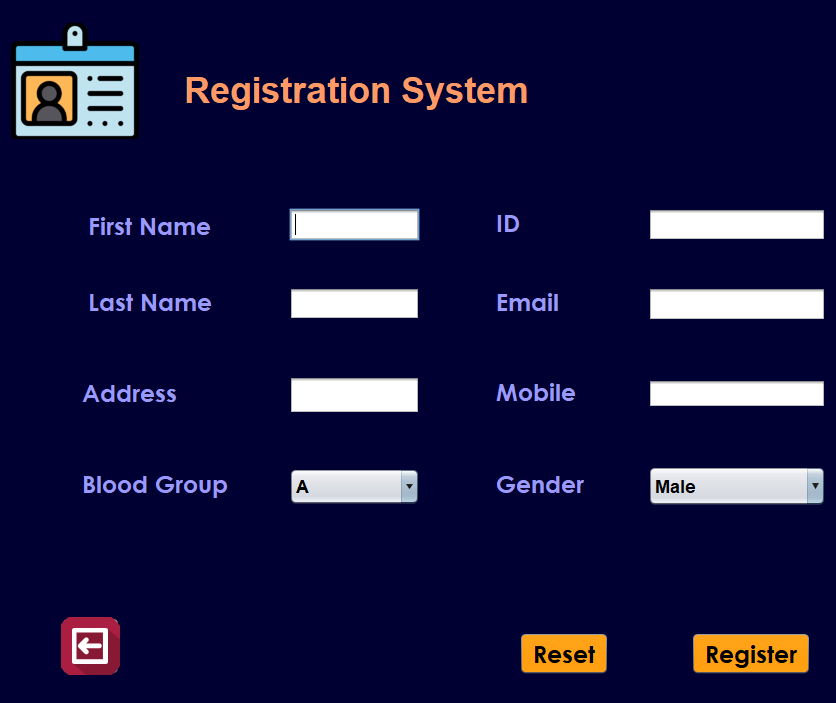
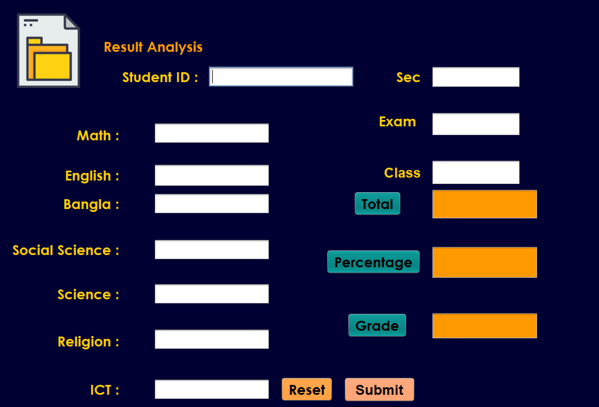
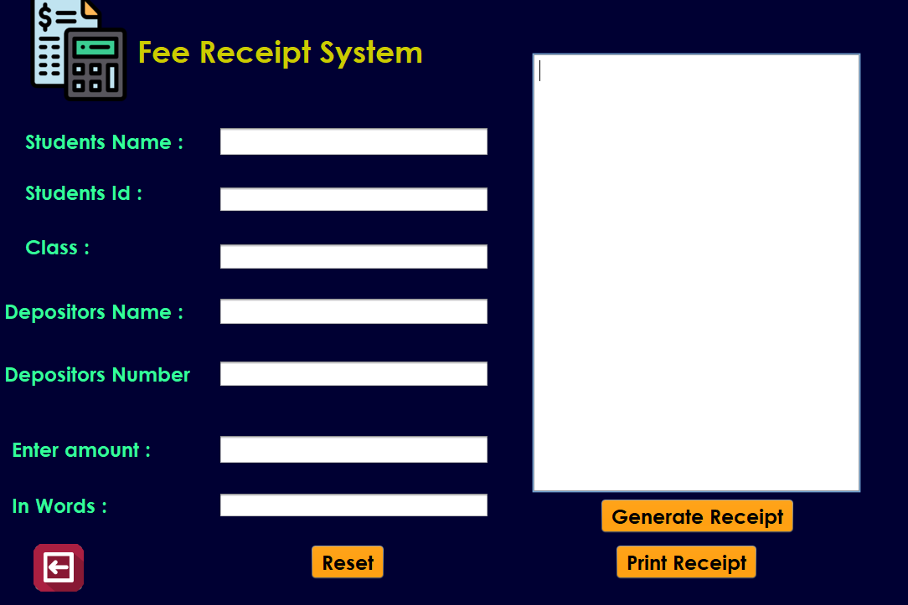
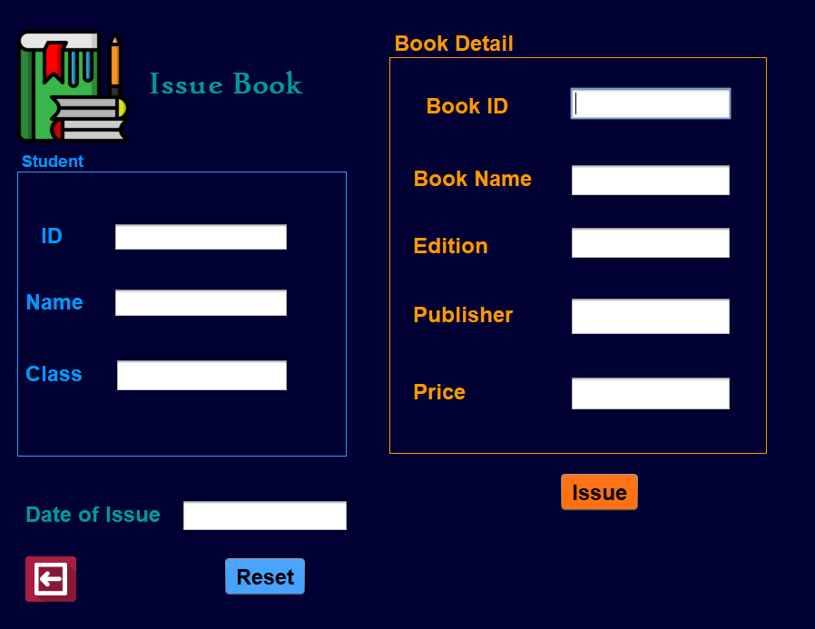
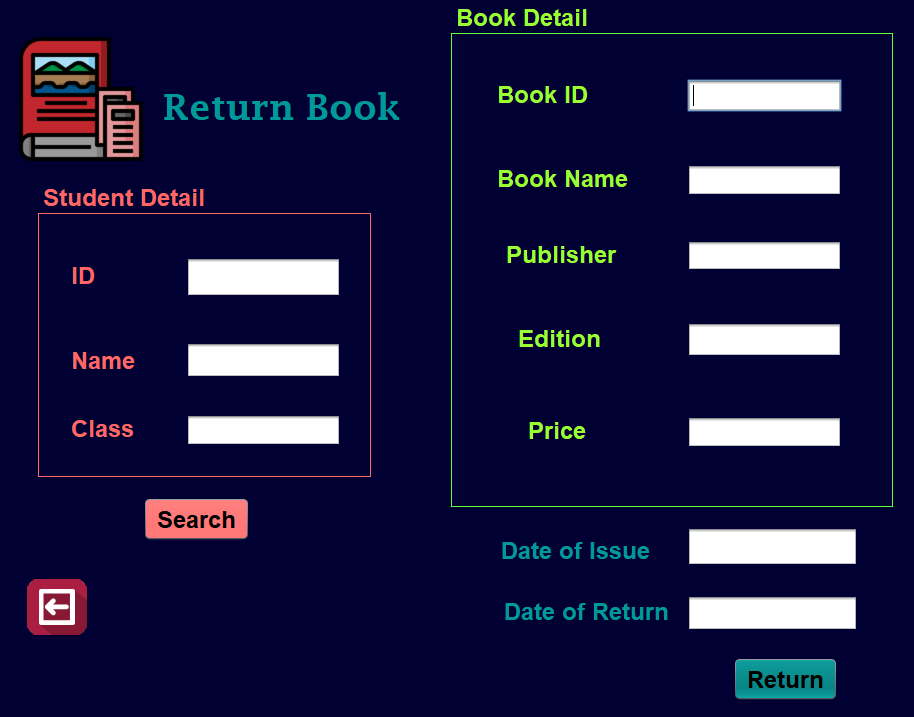
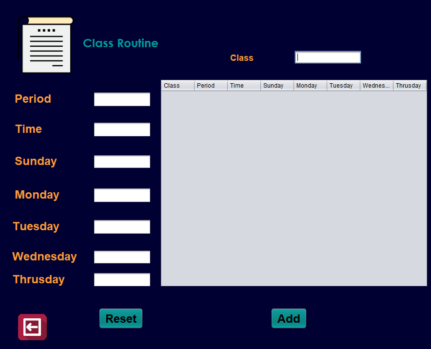
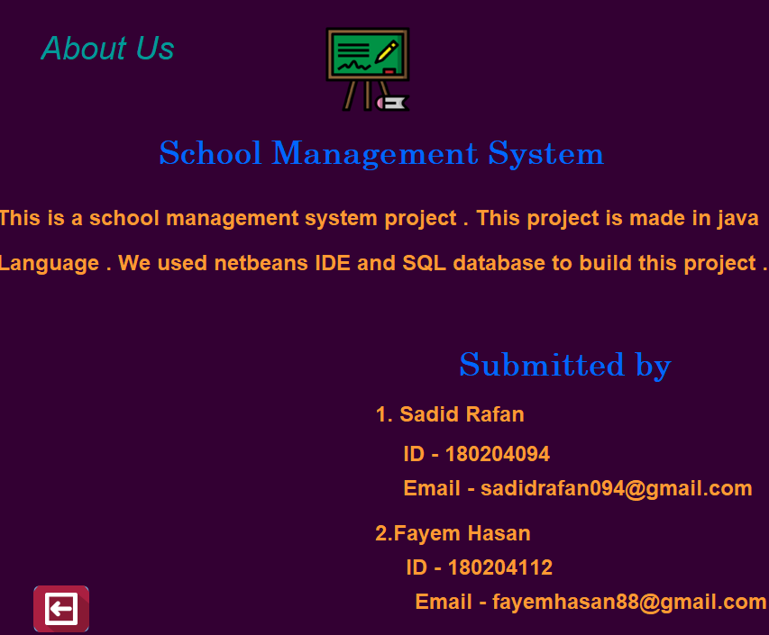

# E-school
This is a software development lab project. This is a school management system. Through this desktop application students can login , register easily. Student can get their result through this desktop application . They can manage their admission fees . They can , manage their admission fees. They can see class routine and issue/return book.

## Software Specification 
* Language : Java , java swing
* Database : MySql , Xampp
* IDE : Netbeans

## Features:
* User Login and Registration System with mysql xampp
* Home page
* Result Analysis
* Manage Admission fees
* See Class routine
* Issue & return book

Wanna run this app ? download this ! 

## Project Demo : 
 

 

 

 

 

